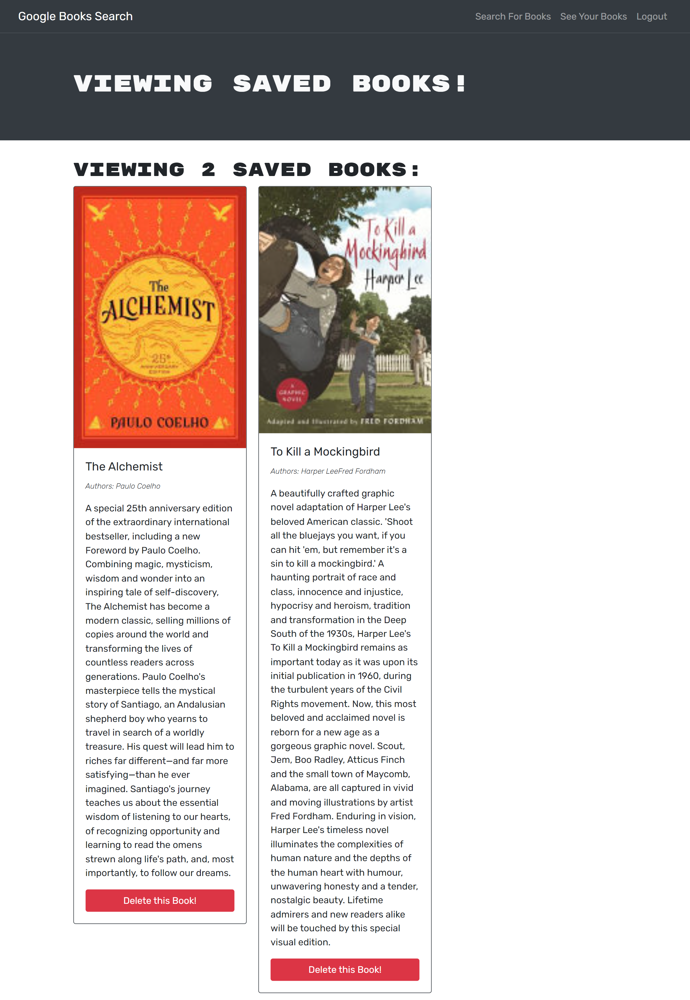

# Apollo Server/GraphQL Book Search Engine

## Description

This application is a Google Books API search engine in GraphQL API built with Apollo Server. The app was built using the MERN stack with a React front end, MongoDB database, and Node.js/Express.js server and API. A user of this application can search for books using the search bar. Once signed up and logged in, they can also save a book from their search and view the list of their saved books in another part of the application.

The application is deployed in Heroku.

## Website

Visit [this](https://radiant-garden-04848.herokuapp.com/) to see the application in action.

## Demo

The following images shows the web application's appearance and functionality:




## Installation

Make sure to have MongoDB on your local machine.

After forking the project, go to the root directory and run the code below to install the modules needed to run this program:

```
npm install
```

## Usage

To run the program, run the code below:

```
npm run build
```

This will create the bundled up version of the application under `/client/dist` folder. Right-click on the `index.html` file and select `Open with Live Server`.
